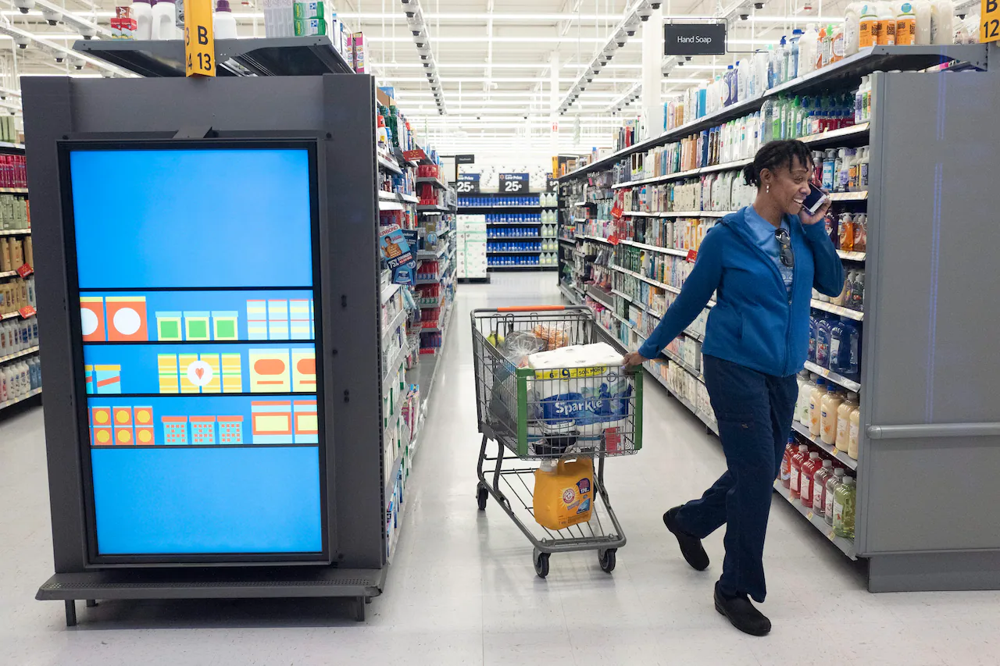

# Global-Super-Store-Analysis

## About Project
Global Superstore is a global online retailer based in New York, boasting a broad product catalog and
aiming to be a one-stop-shop for its customers. Global The superstore’s clientele, hailing from 147
different countries, can browse through an endless offering with more than 10,000 products. This large
selection comprises three main categories: office supplies (e.g., staples), furniture (e.g., chairs), and
technology (e.g., smartphones).

I was contracted as a Data Analyst to help Global Superstore analyze and draw out meaningful insight
from the Superstore dataset which would aid the management in making informed decisions to improve
performance and profitability.

Using the following skills 

● Power Query

● Data Modeling

● Data Cleaning

● Data Visualization

● Knowledge of generating actionable insights Etc

## Problem Statement

Question 1.

a) What are the three countries that generated the highest total profit for Global Superstore in 2014?

b) For each of these three countries, find the three products with the highest total profit. Specifically,
what are the products’ names and the total profit for each product?

Question 2.

a) Identify the 3 subcategories with the highest average shipping cost in the United States.

Question 3.

a) Assess Nigeria’s profitability (i.e., total profit) for 2014. How does it compare to other African
countries?

b) What factors might be responsible for Nigeria’s poor performance? You might want to investigate
shipping costs and the average discount as potential root causes.

Question 4.

a) Identify the product subcategory that is the least profitable in Southeast Asia.
Note: For this question, assume that Southeast Asia comprises Cambodia, Indonesia, Malaysia, Myanmar
(Burma), the Philippines, Singapore, Thailand, and Vietnam.

b) Is there a specific country i n Southeast Asia where Global Superstore should stop offering the
subcategory identified in 4a?

Question 5.

a) Which city is the least profitable (in terms of average profit) in the United States? For this analysis,
discard the cities with less than 10 Orders. b) Why is this city’s average profit so low?

Question 6.

a) Which product subcategory has the highest average profit in Australia?

Question 7.

a)Who are the most valuable customers and what do they purchase?

## insights

1a. Countries with the highest total profit for 2014 were United States, China and India

b.

•	For the United States, the Canon image CLASS 2200 Advanced Copier, Hewlett Packard LaserJet 3310 Copier and GBC Docu-Bind TL300 Electric Binding System were products that made the highest profit.

•	For China, the Sauder Classic Bookcase, Metal Bush Classic Bookcase, and the Mobil HP Copy Machine Color System were products that made the highest profit.

•	For India, the Sauder Classic Bookcase, Traditional Cisco Smart Phone with Caller ID and Hamilton Beach Refrigerator Red, were products that made the highest profit.

2. Three Subcategories with the Highest average shipping cost in the United States were: Copiers, Machines and Tables with average shipping cost of $165.29, $132.25, $69.95 respectively.

3. Nigeria had the greatest loss with a loss of $23,285.19
b. Looking at the analysis, Nigeria had the greatest discount rate, which resulted in country incurring losses
4. The least profitable subcategories in South-east Asia were Accessories, Supplies, Tables with losses of $8,641.53, $4,034.22 and $18,618.31 respectively. With that the Table Subcategory incurred the greatest loss
b. Indonesia, should stop offering the Table subcategory, because they had a loss f $10,680.28

5. Lancaster with an Average Profit of $157.4 was the least Profitable city in the United States
 
6. Copiers with $105.06 had the highest Average profit in Australia
  
7. Tamara Chand, Raymond Buch and Sanjit Chand were the most valuable customers, with Technologies, being their most purchased categories

## Dashboard

